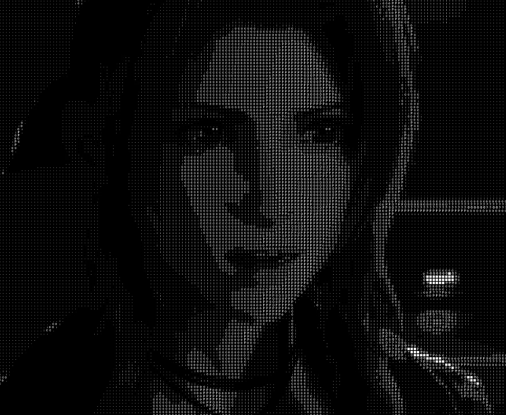

```
  ___           _ _                        _                                _            
 / _ \         (_|_)                      | |                              (_)           
/ /_\ \___  ___ _ _     _ __ ___ _ __   __| | ___ _ __      ___ _ __   __ _ _ _ __   ___ 
|  _  / __|/ __| | |   | '__/ _ \ '_ \ / _` |/ _ \ '__|    / _ \ '_ \ / _` | | '_ \ / _ \
| | | \__ \ (__| | |   | | |  __/ | | | (_| |  __/ |      |  __/ | | | (_| | | | | |  __/
\_| |_/___/\___|_|_|   |_|  \___|_| |_|\__,_|\___|_|       \___|_| |_|\__, |_|_| |_|\___|
                                                                       __/ |             
                                                                      |___/              
```


This program extracts frames from a video file and processes them to display a **quantized mosaic visualization** in real time using **SDL2**.



https://github.com/user-attachments/assets/c4a85c45-899b-42e4-9996-00ba79a45079


## How It Works

**Frame Extraction**:
   - Uses `ffmpeg` via an external thread to extract `.jpg` images into `video_data/`.

**Frame Processing Loop**:
   - Waits until a minimum number of frames are available.
   - Loads one frame at a time and:
     - Converts it to grayscale.
     - Downscales it into 8×8 pixel blocks.
     - Maps luminance to one of 10 tile images (0–9).
     - Renders the mosaic in a SDL2 window.

**Visualization**:
   - Each tile represents a quantized brightness level.
   - Rendering continues until all frames are processed or the user exits.

## Compilation

To compile the program, make sure you have `SDL2` `SDL2_image` `stb` and `ffmpeg` installed:

```bash
gcc -O2 image_processing.c -o image_processing -lm `sdl2-config --cflags --libs` -lSDL2_image
```

## Usage

```bash
./image_processing input.mp4
```

## Folder Structure

- `video_data/` – Temporary storage for extracted frames.
- `char/` – Folder containing 10 grayscale tile images (`0.png` to `9.png`).

## Dependencies

- [SDL2](https://www.libsdl.org/)
- [stb_image.h](https://github.com/nothings/stb) 
- [ffmpeg](https://ffmpeg.org/)
